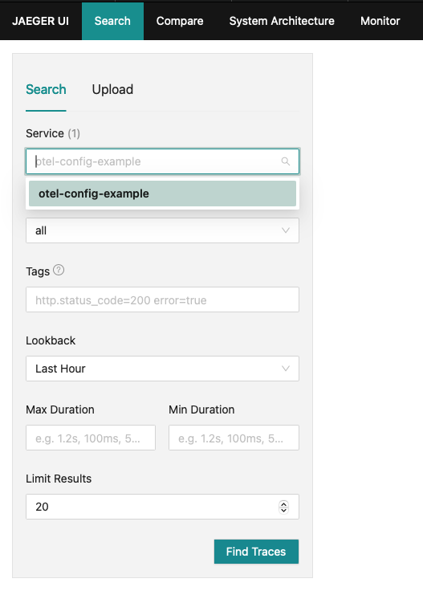

# Helidon OpenTelemetry SE Example

This project implements a simple Hello World REST service using Helidon SE and using OpenTelemetry tracing prepared using Helidon configuration.

## Download and start a telemetry back-end
One easy way to see telemetry in action is to run a back-end server that can collect OpenTelemetry OTLP telemetry data and display it. This example Helidon service by default uses OpenTelemetry to transmit its data using OTLP.

One option is to download the [Jaeger back-end](https://www.jaegertracing.io/download/), install it, and run it, but most modern backends support OTLP. Later steps in this example use Jaeger as an example back-end.

## View the telemetry configuration
Look at the `src/main/resources/application.yaml` file. It contains configuration for OpenTelemetry. Note these settings under `telemetry`:
* `service` - Assigns the service name by which all telemetry from this application is identified. You will use this later when using the telemetry back-end UI to browse traces.
* `tracing.attributes` - Declares settings applied to all traces transmitted to the back-end.
* `processors` - Specifies a single span processor, `simple`, which emits each span as soon as it is ended. This makes sure that OpenTelemetry sends span data to the back-end as soon as possible. 

**NOTE**: In production systems, you should use the default `batch` processor type (with its additional settings if you wish) for better network performance.

## Build and run

With JDK21
```bash
mvn package
java -jar target/helidon-examples-telemetry-se-config.jar
```

## Exercise the application

Basic:
```
curl -X GET http://localhost:8080/simple-greet
Hello World!
```


JSON:
```
curl -X GET http://localhost:8080/greet
{"message":"Hello World!"}

curl -X GET http://localhost:8080/greet/Joe
{"message":"Hello Joe!"}

curl -X PUT -H "Content-Type: application/json" -d '{"greeting" : "Hola"}' http://localhost:8080/greet/greeting

curl -X GET http://localhost:8080/greet/Jose
{"message":"Hola Jose!"}
```

## Use the telemetry back-end to view tracing information
Use a browser to access the back-end UI and view the spans. For example, with Jaeger:
1. Access `http://localhost:16686`.
2. Expand the upper-left "Service" drop list and select "otel-config-example" and then click the "Find Traces" button. 
   
   Recall that the configuration assigns "otel-config-example" as the `telemetry.service`, so that is the service name the back-end displays.
3. The UI displays separate traces for each of the requests you made to the Helidon service.
4. Click on one of the traces.
5. The back-end shows two or more spans, depending on which trace you clicked. 
6. Click on any of the spans.  Note that the "Process" tags include values for `x` and `y` from the `attributes` settings in the `application.yaml` config file.

## Building a Native Image

The generation of native binaries requires an installation of GraalVM 22.1.0+.

You can build a native binary using Maven as follows:

```
mvn -Pnative-image install -DskipTests
```

The generation of the executable binary may take a few minutes to complete depending on
your hardware and operating system. When completed, the executable file will be available
under the `target` directory and be named after the artifact ID you have chosen during the
project generation phase.

Make sure you have GraalVM locally installed:

```
$GRAALVM_HOME/bin/native-image --version
```

Build the native image using the native image profile:

```
mvn package -Pnative-image
```

This uses the helidon-maven-plugin to perform the native compilation using your installed copy of GraalVM. It might take a while to complete.
Once it completes start the application using the native executable (no JVM!):

```
./target/helidon-examples-telemetry-se-config
```

Yep, it starts fast. You can exercise the application’s endpoints as before.


## Building the Docker Image

```
docker build -t helidon-examples-telemetry-se-config .
```

## Running the Docker Image

```
docker run --rm -p 8080:8080 helidon-examples-telemetry-se-config:latest
```

Exercise the application as described above.
                                

## Run the application in Kubernetes

If you don’t have access to a Kubernetes cluster, you can [install one](https://helidon.io/docs/latest/#/about/kubernetes) on your desktop.

### Verify connectivity to cluster

```
kubectl cluster-info                        # Verify which cluster
kubectl get pods                            # Verify connectivity to cluster
```

### Deploy the application to Kubernetes

```
kubectl create -f app.yaml                              # Deploy application
kubectl get pods                                        # Wait for quickstart pod to be RUNNING
kubectl get service  helidon-examples-telemetry-se-config                     # Get service info
kubectl port-forward service/helidon-examples-telemetry-se-config 8081:8080   # Forward service port to 8081
```

You can now exercise the application as you did before but use the port number 8081.

After you’re done, cleanup.

```
kubectl delete -f app.yaml
```

